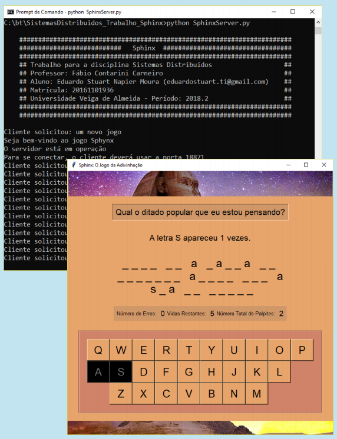

# Sphinx: O Jogo

## Proposta
  Idealizado e desenvolvido com o objetivo de demonstrar algumas técnicas da computação distribuída.

  Usando a arquitetura **cliente-servido**, o projeto, inteiramente desenvolvido na linguagem **Python**, apresenta a seguinte estrutura:
    * O **cliente**, que deve ser ativado pelo jogador, representa a interface do jogo. O objetivo consiste em tentar adivinhar um provérbio famoso, escolhido aleatoriamente pelo servidor, selecionando uma letra de cada vez.  
    * O **servidor**, que pode estar hospedado em qualquer máquina que tiver conexão com a internet, fica encarregado de receber as requisições do cliente e respondê-las de acordo com a solicitação ou da etapa em que o jogo se encontra. É ele que controla toda a lógica envolvida pelo jogo.

## Alguns destaques do projeto
  * Interamente desenvolvido na linguagem **Python**, versão 3.6
  * Tem como objetivo demonstrar como é possível criar uma solução **cliente-servidor** usando o **Python**
  * Todos os algoritmos necessários para uma boa realização das partidas estão fartamente comentados
  * O servidor é capaz de responder a inúmeras requisições simultâneas de diversos clientes
  * O cliente possui uma interface gráfica desenvolvida usando a biblioteca **Tkinter**
  * O servidor exibe no terminal cada uma das requisições feitas, incluindo mensagens de estado e outras informações pertinentes ao projeto

## Como executá-lo
  Por ter sido desenvolvido em **Python**, não é preciso compilar os arquivos que integram o projeto**Sphinx**. No entanto, será preciso instalar na máquina as dependências para que o projeto possa ser executado ─ como as bibliotecas **Tkinter**, **RPYC**, etc.

  Todas as instruções, que são bastante simples de serem seguidas, podem ser obtidas no seguinte manual de instruções: [Sphinx: O Jogo - Manual em PDF](https://github.com/eduardo-stuart/Sphinx/blob/master/Sphinx%20-%20Trabalho%20da%20disciplina%20Sistemas%20Distribu%C3%ADdos.pdf)

## Sobre
  Desenvolvido por **Eduardo Stuart**, você pode entrar em contato comigo via o meu [LinkedIn](https://www.linkedin.com/in/eduardo-stuart/).   